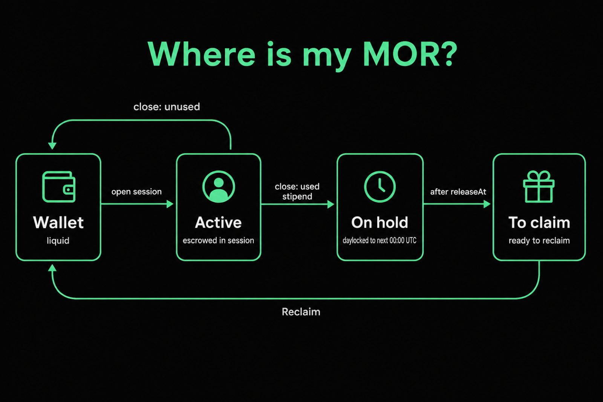

# 3. GUI basics

[← Bootstrap](02-bootstrap.md) · [Guide home](README.md) · [Next: Apps →](04-clients.md)

One topic at a time. You do not need every section on day one.

---

## Login

- URL: `https://<your-host>/gui/`
- User: `admin`
- Password: `ADMIN_PASSWORD`

---

## API Keys

| Kind | Survives wipe / redeploy? | Role |
|------|---------------------------|------|
| **Master** | Yes (`API_KEY_SEED`) | Inference + admin API |
| **Prompt** | Yes (`API_KEY_SEED`) | Inference only — default for clients |
| **Ephemeral** | No — export/import | Named keys for apps/agents |

- Rotate built-ins by changing `API_KEY_SEED` and restarting.
- Ephemeral: create, red trash to delete, **Export all** / **Import list** after redeploy.

---

## Where is my MOR?

Opening a session moves stake from **Wallet → Active** (escrow for the full session duration). What happens next depends on **how the session ends** — not on how many tokens you prompted with.

| How the session ends | Liquid (back to Wallet on the close tx) | Time-locked (**On hold**) |
|----------------------|-----------------------------------------|---------------------------|
| **Close early** (GUI / housekeeping / router close before end) | Unused time portion of the stake | Used time portion |
| **Expire naturally** (session runs to its end time) | Nothing | **Entire** stake |

Then the clock:

1. **On hold** — daylocked until the next UTC midnight (`releaseAt`).
2. **To claim** — past `releaseAt`; ready to pull back.
3. **Reclaim** — `withdrawUserStakes` (Status button, or auto ~00:05 UTC) → **Wallet**.

| Bucket | Meaning |
|--------|---------|
| **Wallet** | Spendable MOR |
| **Active** | Open session stake |
| **On hold** | Closed/expired stake still daylocked |
| **To claim** | Daylock done — reclaim to Wallet |

**Practical tip:** if you only need a short burst, close the session when you are done so unused duration returns immediately as liquid. If you leave sessions open until they expire, plan float for the **full** stake until the next reclaim cycle.

Deeper: [nodedocs — Where is my MOR?](https://nodedocs.mor.org/ai/where-is-my-mor) · [tech.mor.org/session.html](https://tech.mor.org/session.html)

---

## Sessions & Usage

- Open sessions rehydrate from chain after restart (still-valid ones are reused).
- **Usage** counters are local scratchpad — they reset on redeploy; funds do not.

---

## Probe

1. Open **Probe**.
2. Pick a model (fuzzy search) and an API key.
3. **Run test** or **Copy curl**.
4. Confirm a normal completion in **Response**.

---

## Logs & support

Router / container logs are **not** streamed into the GUI yet.

| Source | How |
|--------|-----|
| GUI Status | Health, version chips, MOR buckets, reclaim |
| Support JSON | Status → **Download support bundle** (no private keys) |
| Host logs | `docker logs <uplink\|proxy-router>` or your platform log panel |

---

[← Bootstrap](02-bootstrap.md) · [Guide home](README.md) · [Next: Apps →](04-clients.md)
